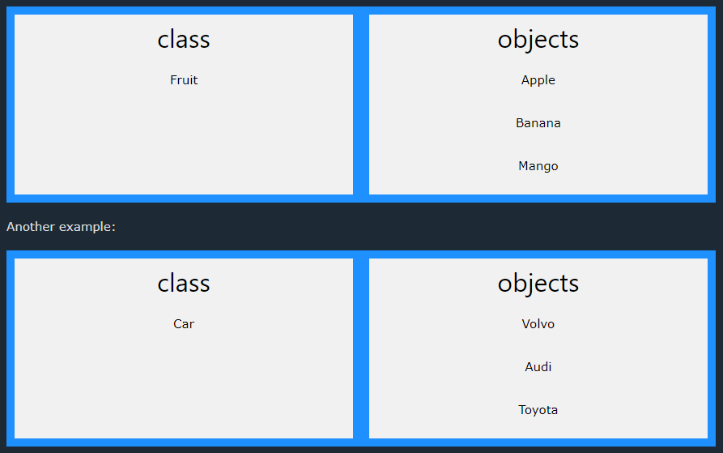

## PHP What is OOP?

OOP stands for Object-Oriented Programming.

Procedural programming is about writing procedures or functions that perform operations on the data, while object-oriented programming is about creating objects that contain both data and functions.

Object-oriented programming has several advantages over procedural programming:

- OOP is faster and easier to execute
- OOP provides a clear structure for the programs
- OOP helps to keep the PHP code DRY "Don't Repeat Yourself", and makes the code easier to maintain, modify and debug
- OOP makes it possible to create full reusable applications with less code and shorter development time

**Tip:** The "Don't Repeat Yourself" (DRY) principle is about reducing the repetition of code. You should extract out the codes that are common for the application, and place them at a single place and reuse them instead of repeating it.

## PHP - What are Classes and Objects?

Classes and objects are the two main aspects of object-oriented programming.

Look at the following illustration to see the difference between class and objects:



So, a class is a template for objects, and an object is an instance of a class.

When the individual objects are created, they inherit all the properties and behaviors from the class, but each object will have different values for the properties.

Look at the next chapters to learn more about OOP.

## OOP Case

Let's assume we have a class named Fruit. A Fruit can have properties like name, color, weight, etc. We can define variables like $name, $color, and $weight to hold the values of these properties.

When the individual objects (apple, banana, etc.) are created, they inherit all the properties and behaviors from the class, but each object will have different values for the properties.

## Define a Class

A class is defined by using the `class` keyword, followed by the name of the class and a pair of curly braces ({}). All its properties and methods go inside the braces:

```php
<?php
class Fruit {
  // code goes here...
}
?>
```

Below we declare a class named Fruit consisting of two properties ($name and $color) and two methods set_name() and get_name() for setting and getting the $name property:

```php
<?php
class Fruit {
  // Properties
  public $name;
  public $color;

  // Methods
  function set_name($name) {
    $this->name = $name;
  }
  function get_name() {
    return $this->name;
  }
}
?>
```

****Note: In a class, variables are called properties and functions are called methods!****

## PHP - The $this Keyword

The $this keyword refers to the current object, and is only available inside methods.

Look at the following example:

```php
<?php
class Fruit {
  public $name;
}
$apple = new Fruit();
?>
```

So, where can we change the value of the $name property? There are two ways:

1. Inside the class (by adding a set_name() method and use $this):

```php
<?php
class Fruit {
  public $name;
  function set_name($name) {
    $this->name = $name;
  }
}
$apple = new Fruit();
$apple->set_name("Apple");

echo $apple->name;
?>
```

2. Outside the class (by directly changing the property value):

```php
<?php
class Fruit {
  public $name;
}
$apple = new Fruit();
$apple->name = "Apple";

echo $apple->name;
?>
```
