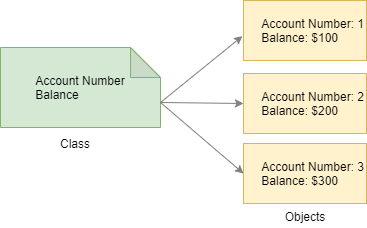

## What is an Object

If you look at the world around you, you’ll find many examples of tangible objects: lamps, phones, computers, and cars. Also, you can find intangible objects such as bank accounts and transactions.

All of these objects share the two common key characteristics:

- State
- Behavior

For example, a bank account has the state that consists of:

- Account number
- Balance

A bank account also has the following behaviors:

- Deposit
- Withdraw

PHP objects are conceptually similar to real-world objects because they consist of state and behavior.

An object holds its state in variables that are often referred to as properties. An object also exposes its behavior via functions which are known as methods.

## What is a class?
In the real world, you can find many same kinds of objects. For example, a bank has many bank accounts. All of them have account numbers and balances.

These bank accounts are created from the same blueprint. In object-oriented terms, we say that an individual bank account is an instance of a Bank Account class.

By definition, a class is the blueprint of objects. For example, from the Bank Account class, you can create many bank account objects.

The following illustrates the relationship between the `BankAccount` class and its objects. From the `BankAccount` class you can create many `BankAccount` objects. And each object has its own account number and balance.



## Define a class
To define a class, you specify the `class` keyword followed by a name like this:
```php
<?php

class className
{
    //...
}
```

For example, the following defines a new class called `BankAccount`:

```php
<?php

class className
{
}
```

By convention, you should follow these rules when defining a class:

- A class name should be in the upper camel case where each word is capitalized. For example, `BankAccount`, `Customer`, `Transaction`, and `DebitNote`.

- If a class name is a noun, it should be in the singular noun.

- Define each class in a separate PHP file.

From the `BankAccount` class, you can create a new bank account object by using the `new` keyword like this:

```php
<?php

class BankAccount
{
}

$account = new BankAccount();
```

In this syntax, the `$account` is a variable that references the object created by the `BankAccount` class. The parentheses that follow the `BankAccount` class name are optional. Therefore, you can create a new `BankAccount` object like this:

```php
$account = new BankAccount;
```

The process of creating a new object is also called instantiation. In other words, you instantiate an object from a class. Or you create a new object from a class.

The `BankAccount` class is empty because it doesn’t have any state and behavior.

